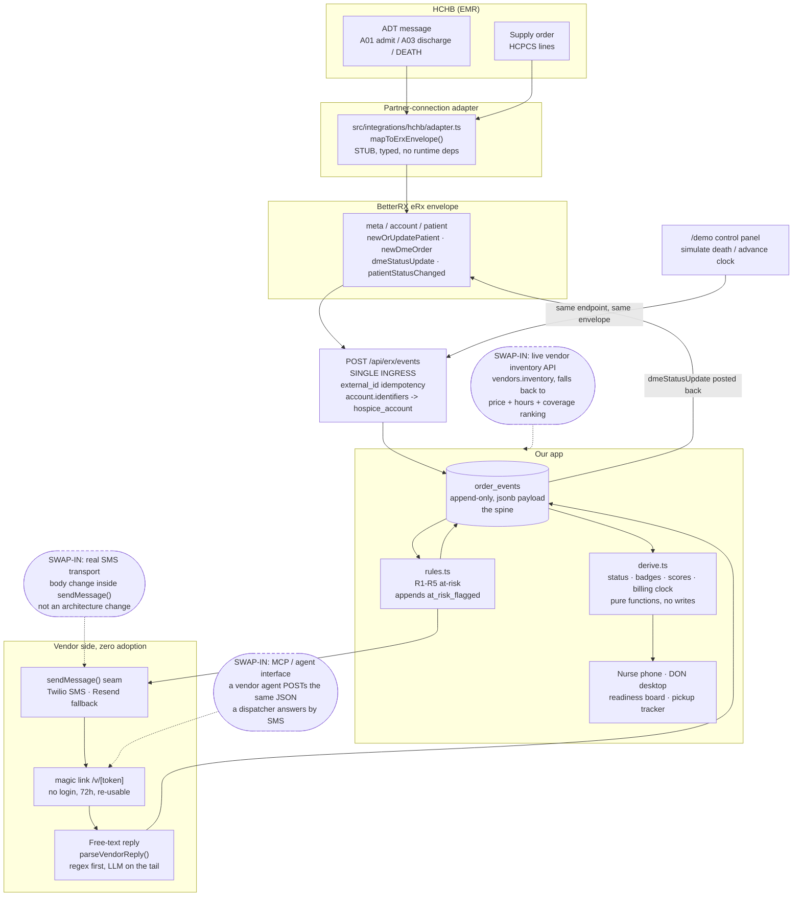

# Integration Approach (deliverable D)

How this connects to BetterRX eRx and to one EMR, including the shape of the record as it moves between systems. The brief says a diagram is enough `[brief]`, so this is a diagram plus the record shape plus the two things that make it real: idempotency and tenancy.

**Design target: HCHB.** It is the largest hospice EMR `[kickoff-qa]` and it ships a purpose-built integration layer for DME and supply ordering with real-time patient status sharing to outside vendors `[brief]`. MatrixCare is the bi-directional precedent worth naming (its DME interface is built into the hospice EHR rather than bolted on `[brief]`), but we design against HCHB.

**Why partner-connection and not an API standard.** No pharmacy-style e-prescribing standard exists for DME. There is no front-end ordering standard at all `[brief]` `[landscape]`. Equipment is identified by HCPCS Level II E-codes (500+ of them), and billing runs through the generic ANSI X12 837 claims transaction, which is not DME-specific `[brief]`. So real DME integration happens through each EMR's own partner-connection layer, and that is the pattern we built the seam for.

**Where the sponsor says the gap actually is.** At kickoff: the hospice-EMR side is already done, and the integration work is on the DME vendor side, "if we want some of that data regarding deliveries and inventory." They do not know whether that means a portal, an integration, or magic links, and they left the call to us `[kickoff-qa]`. We made the call: magic links and SMS, because the baseline vendor never logs in `[faq]`.

---

## The flow



**Read the diagram in one line:** HCHB pushes ADT and supply orders, the adapter maps them to the eRx envelope, one endpoint accepts them, everything lands in `order_events`, and everything downstream (status, badges, scores, dollars) is derived from that log rather than stored beside it.

---

## Swap-in points, labeled

Forward-compatible design is what the sponsor said they value most in judging `[faq]`, so each seam is one function, not a layer.

1. **Live vendor inventory.** Unlikely to exist in practice, and the sponsor asked us to architect for it anyway with a graceful fallback `[faq]`. `vendors.inventory` is a column the compare step reads. When it is null, the compare card ranks on price, hours, coverage, and equipment match, and the card states which mode it is in. A real inventory check drops in behind the same read.

2. **Real SMS transport.** All outbound comms go through one `sendMessage()` seam. Twilio is the vendor channel today; Resend covers fallback. Changing carrier is a body change inside one function.

3. **MCP / agent-to-agent.** The magic-link route already accepts JSON. A vendor's agent can POST the same payload a human dispatcher answers by SMS, so the machine interface exists without a second protocol. We are not building a two-sided A2A demo, because both agents would be ours and that proves nothing `[team]`.

4. **LLM provider.** `parseVendorReply()` is provider-agnostic by contract.

---

## The record shape

The envelope mirrors BetterRX's real eRx payloads, supplied in the FAQ `[faq]`. A DME product carries an **HCPCS E-code exactly where a medication carries an NDC**. That parallel is `[assumed]`, extrapolated from the two payloads BetterRX gave us, not a published DME spec.

```ts
export interface ErxEnvelope<T extends string, B> {
  meta: { eventType: T };
  account: { identifiers: { id: string }[] };
  patient: { identifiers: { id: string; idType: string }[] } & B;
}

export interface ErxDmeItem {
  externalId: string;                                          // our orders.id
  product: { codeType: 'HCPCS'; code: string; name: string };  // 'E0260' / 'Hospital bed (semi-electric)'
  quantity: number;
  urgency: OrderUrgency;                                       // 'admission' | 'routine' | 'stat'
  targetDateTime: Iso | null;                                  // "needed by"
  deliveryAddress: Address;
  physician?: { identifier: { id: string; idType: 'npi' } };
  notes?: string;
}

export type NewDmeOrder = ErxEnvelope<'newDmeOrder', { dmeOrders: ErxDmeItem[] }>;

export type DmeStatusUpdate = ErxEnvelope<'dmeStatusUpdate', {
  dmeOrders: {
    externalId: string;
    status: OrderStatus;
    derivedFlags: ('AT_RISK' | 'PICKUP_DELAYED')[];  // derived, never a status
    vendor: { id: string; name: string } | null;
    eta: Iso | null;
    deliveredAt: Iso | null;
    pickupRequestedAt: Iso | null;                   // billing-clock stop, timestamped and provable
    pickedUpAt: Iso | null;
    reason?: string;                                 // the at_risk_flagged explanation, verbatim
  }[];
}>;
```

**Inbound direction.** The EMR partner-connection layer pushes `newOrUpdatePatient`; we consume `demographics` into `patients`, and a `deceased` or `discharged` status change into a `patient_status_changed` event. That inbound path is the **redundant fallback**. The nurse's bedside button is the primary trigger, which is the sponsor's stated preference, not our guess: BetterRX has seen the EMR-only path fail in production, where a death did not reach the DME vendor's system in time for pickup `[faq]`.

**Outbound direction.** `newDmeOrder` on placement, `dmeStatusUpdate` on every status transition. This is the direction the field does not have: the Axxess to Qualis integration is a documented one-way push with no delivery status returning to the EMR `[research]`.

---

## What the demo panel actually posts

This is the payload `simulatePatientDeath()` sends from `app/actions/demo.ts`, verbatim in shape:

```json
{
  "meta": { "eventType": "patientStatusChanged" },
  "account": { "identifiers": [{ "id": "ACCT-001" }] },
  "patient": {
    "identifiers": [{ "id": "PT-88190", "idType": "external_id" }]
  },
  "payload": {
    "external_id": "demo-patient-death-PT-88190",
    "patient": { "external_id": "PT-88190" },
    "status": "deceased"
  }
}
```

**Demo traffic enters through the same endpoint HCHB would.** There is no shortcut path and no direct database write behind the demo button. Pressing "simulate death" performs an HTTP POST to `/api/erx/events` on this app's own origin. That is why pressing it twice is a no-op rather than a duplicate: `external_id` is stable per patient (see below).

---

## Idempotency

`order_events.external_id text unique nullable`.

1. An ingested event carries the source system's event id in `external_id`.
2. A replayed webhook hits the unique constraint and no-ops.
3. Internal events (a nurse tap, a rule firing) leave `external_id` null, so the constraint never touches them.

Webhook delivery is at-least-once in every system that ships one, so this is the difference between an integration sketch and an integration. The HCHB adapter derives the value from `messageId`, and for multi-line supply orders from `${messageId}:${lineId}`, so one order line replayed alone still no-ops.

---

## Tenancy

`account.identifiers[0].id` from the envelope maps to `orders.hospice_account`.

The demo seeds a single account, `ACCT-001`. Multi-tenant isolation is a **stated assumption, not a silent one** (`docs/ASSUMPTIONS.md` #7). The honest version for a judge: the tenancy key is carried end to end and stored on the row, so the production step is a Row Level Security policy keyed off that column, not a schema migration. RLS is intentionally skipped for the demo because there is no auth to key it to.

---

## The adapter

`src/integrations/hchb/adapter.ts` is a typed stub. It compiles under strict TypeScript, has no runtime dependencies, and does one thing:

```ts
export function mapToErxEnvelope(message: HchbInboundMessage): MappedEnvelope
```

`HchbAdtMessage` maps to `patientStatusChanged`. `HchbSupplyOrder` maps to `newDmeOrder`, one `ErxDmeItem` per HCPCS line, with `priority` mapped onto our urgency enum.

**The HCHB field names in that file are `[assumed]`.** We have no HCHB API document. What is sourced is only that HCHB ships a purpose-built DME and supply integration layer `[brief]`. The spellings are our extrapolation and are marked as such in the file header, because guessing quietly is the thing the brief penalizes.

---

## What we did not build

- No live EMR connection. The brief says a diagram is enough `[brief]`.
- No X12 837 claims path. Billing is downstream of everything here.
- No vendor-side ERP integration. Brightree already holds the ETA, GPS, and condition photo and does not share them with the hospice `[research]`. Consuming that feed is the obvious phase two, and it is a commercial conversation before it is an engineering one.

Sources: `wiki/facts/integration-and-data.md`, `specs/00-contracts.md`, `specs/data.md` §5, `wiki/facts/constraints-and-assumptions.md`.
